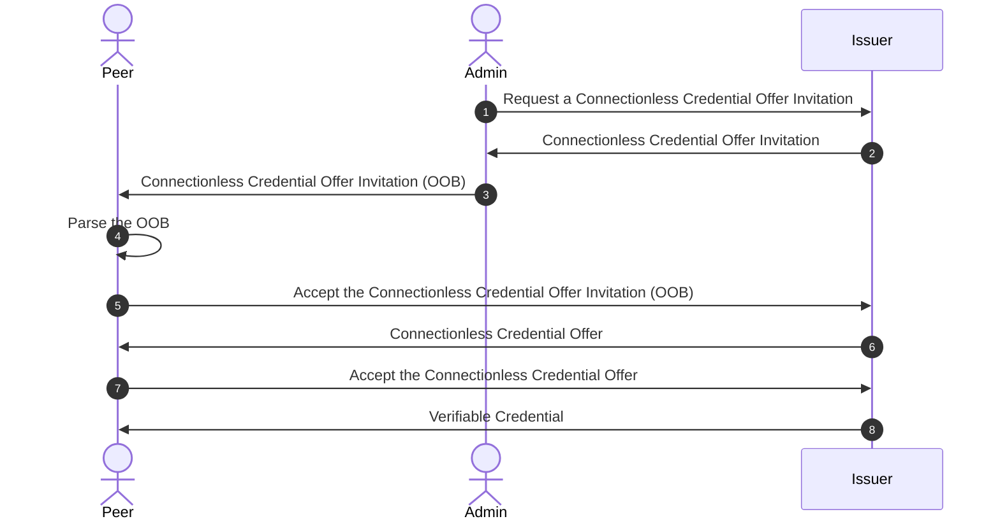

# Edge SDK Connectionless Credential Offer

## User Flow



## Steps

1. The `Admin` creates a Credential Offer as Invitation for connectionless issuance Issuer Agent
  
    ```bash
    curl --location --request POST 'http://localhost:8000/cloud-agent/issue-credentials/credential-offers/invitation' \
    --header 'Content-Type: application/json' \
    --data-raw '{
        "claims": {
            "emailAddress": "sampleEmail",
            "familyName": "",
            "dateOfIssuance": "2023-01-01T02:02:02Z",
            "drivingLicenseID": "",
            "drivingClass": 1
        },
        "goalCode": "issue-vc",
        "goal": "Request issuance",
        "credentialFormat": "JWT",
        "issuingDID": [[publishedPrismDID]],
        "automaticIssuance": true
    }'

    ```

2. The Issuer sends back the `Connectionless Credential Offer Invitation`
    - The response should like something like this:

      ```json
      {
        "recordId": "cf11283a-a9f5-4da0-ae65-be1e57a40710",
        "thid": "b78d7221-0149-4c29-a42e-d8b8c4a9f57d",
        "credentialFormat": "JWT",
        "claims": {
          "emailAddress": "sampleEmail",
          "familyName": "",
          "dateOfIssuance": "2023-01-01T02:02:02Z",
          "drivingLicenseID": "",
          "drivingClass": 1
        },
        "automaticIssuance": true,
        "createdAt": "2024-10-15T01:31:55.303311774Z",
        "role": "Issuer",
        "protocolState": "InvitationGenerated",
        "goalCode": "issue-vc",
        "goal": "Request issuance",
        "myDid": "did:peer:2.Ez6LS...",
        "invitation": {
          "id": "b78d7221-0149-4c29-a42e-d8b8c4a9f57d",
          "type": "https://didcomm.org/out-of-band/2.0/invitation",
          "from": "did:peer:2.Ez6LS...",
          "invitationUrl": "https://my.domain.com/path?_oob=eyJpZCI6ImI3OGQ3MjIxLTAxNDktNGMyOS1hNDJlLWQ4YjhjNGE5ZjU3ZCIsInR5cGUiOiJodHRwczovL2RpZGNvbW0ub3JnL291dC1vZi1iYW5kLzIuMC9pbnZpdGF0aW9uIiwiZnJvbSI6ImRpZDpwZWVyOjIuRXo2TFNnbTg4eW9jTWFMNkQxM203NWdHcDNlUVRQMXZCbjZpRTRDR0d6UnNhTUtOUC5WejZNa3JVaG40UlBCdHRWRXNXWGI1MlFOOWZUOW1LYmV3ZzhRQnBBOE5GOEZxUm9CLlNleUowSWpvaVpHMGlMQ0p6SWpwN0luVnlhU0k2SW1oMGRIQTZMeTh4T1RJdU1UWTRMalk0TGpZeU9qZ3dNREF2Wkdsa1kyOXRiU0lzSW5JaU9sdGRMQ0poSWpwYkltUnBaR052YlcwdmRqSWlYWDE5IiwiYm9keSI6eyJnb2FsX2NvZGUiOiJpc3N1ZS12YyIsImdvYWwiOiJSZXF1ZXN0IGlzc3VhbmNlIiwiYWNjZXB0IjpbImRpZGNvbW0vdjIiXX0sImF0dGFjaG1lbnRzIjpbeyJpZCI6IjdiODM3ZTk3LTYzNzktNDJkNy1hNjY4LTA3OTAzYTFlYmIwNCIsIm1lZGlhX3R5cGUiOiJhcHBsaWNhdGlvbi9qc29uIiwiZGF0YSI6eyJqc29uIjp7ImlkIjoiN2VhMmJlZTMtODgxNC00YjhlLTllNGEtNWZhMDU1YWJiZDUwIiwidHlwZSI6Imh0dHBzOi8vZGlkY29tbS5vcmcvaXNzdWUtY3JlZGVudGlhbC8zLjAvb2ZmZXItY3JlZGVudGlhbCIsImJvZHkiOnsiZ29hbF9jb2RlIjoiT2ZmZXIgQ3JlZGVudGlhbCIsImNyZWRlbnRpYWxfcHJldmlldyI6eyJ0eXBlIjoiaHR0cHM6Ly9kaWRjb21tLm9yZy9pc3N1ZS1jcmVkZW50aWFsLzMuMC9jcmVkZW50aWFsLWNyZWRlbnRpYWwiLCJib2R5Ijp7ImF0dHJpYnV0ZXMiOlt7Im5hbWUiOiJtZW1iZXJPZiIsInZhbHVlIjoiZXlKMGNtbGlaVWxrSWpvaUpYa3hhVkZWZEhWSk5uZEZNMFUyWmpneWNpODFPRTl1U1ZGcE4zTnROMWx4VVVFellrZHNWVUowWTI4OUxtTnNiMkZyWldRaUxDSjBjbWxpWlU1aGJXVWlPaUpYYUdGdVoyRnliMkVnVUdGd1lTQklZWEIxSW4wPSIsIm1lZGlhX3R5cGUiOiJhcHBsaWNhdGlvbi9qc29uIn0seyJuYW1lIjoicGVyc29uIiwidmFsdWUiOiJleUptZFd4c1RtRnRaU0k2SWtKbGJpQlVZV2x5WldFaUxDSmtZWFJsVDJaQ2FYSjBhQ0k2SWpFNU9EY3ZXRmd2V0ZnaWZRPT0iLCJtZWRpYV90eXBlIjoiYXBwbGljYXRpb24vanNvbiJ9XX19fSwiYXR0YWNobWVudHMiOlt7ImlkIjoiODJkMjI1NDctY2VmNS00YjkwLTg5MTQtOGQzY2M2ZGM2MjFlIiwibWVkaWFfdHlwZSI6ImFwcGxpY2F0aW9uL2pzb24iLCJkYXRhIjp7Impzb24iOnsib3B0aW9ucyI6eyJjaGFsbGVuZ2UiOiI5Y2Y3ZmE4OC05MGM5LTQyZTMtOTI1MC0xOGZjMzZhYjkzYWMiLCJkb21haW4iOiJkb21haW4ifSwicHJlc2VudGF0aW9uX2RlZmluaXRpb24iOnsiaWQiOiI5YTJhYjgyNi1iOWZjLTQ3ZjEtOGM0Mi1hMGFhMjI1ZjQwMzAiLCJpbnB1dF9kZXNjcmlwdG9ycyI6W10sImZvcm1hdCI6eyJqd3QiOnsiYWxnIjpbIkVTMjU2SyJdfX19fX0sImZvcm1hdCI6InByaXNtL2p3dCJ9XSwidGhpZCI6ImI3OGQ3MjIxLTAxNDktNGMyOS1hNDJlLWQ4YjhjNGE5ZjU3ZCIsImZyb20iOiJkaWQ6cGVlcjoyLkV6NkxTZ204OHlvY01hTDZEMTNtNzVnR3AzZVFUUDF2Qm42aUU0Q0dHelJzYU1LTlAuVno2TWtyVWhuNFJQQnR0VkVzV1hiNTJRTjlmVDltS2Jld2c4UUJwQThORjhGcVJvQi5TZXlKMElqb2laRzBpTENKeklqcDdJblZ5YVNJNkltaDBkSEE2THk4eE9USXVNVFk0TGpZNExqWXlPamd3TURBdlpHbGtZMjl0YlNJc0luSWlPbHRkTENKaElqcGJJbVJwWkdOdmJXMHZkaklpWFgxOSJ9fX1dLCJjcmVhdGVkX3RpbWUiOjE3Mjg5NTU5MTUsImV4cGlyZXNfdGltZSI6MTcyODk1NjIxNX0="
        },
        "metaRetries": 5
      }
      ```

3. The `Admin` forwards the `invitationUrl` on to the `Peer`

4. The `Peer` checks the validity of the `invitationUrl` using `agent.parseInvitation`

    - `parseInvitation` decodes and validates the encoded Out of Band Invitation, plus attachments, returning an instance of  `OutOfBandInvitation` on success. This OutOfBandInvitation will have a single Attachment for the Credential Offer.

      ```typescript
      const oob = await agent.parseInvitation(invitationUrl)
      ```

5. The `Peer` accepts the Invitation using `agent.acceptInvitation`

    - In this case, with an attached Credential Offer, the Credential Offer Message will be stored in Pluto.

      ```typescript
      await agent.acceptInvitation(oob)
      ```

6. The `Issuer` will then send back the credential offer.
7. The `Peer` listens for the credential offer response from the `Issuer`, accepts it

    ```typescript
    agent.addListener(SDK.ListenerKey.MESSAGE, async (newMessages: SDK.Domain.Message[]) => {
      // newMessages can contain any didcomm message that is received, including
      // Credential Offers, Issued credentials and Request Presentation Messages
      const credentialOffers = newMessages.filter(
        (message) => message.piuri === 'https://didcomm.org/issue-credential/3.0/offer-credential'
      )

      if (credentialOffers.length) {
        for (const credentialOfferMessage of credentialOffers) {
          try {
            // Create credential offer object from the message
            const credentialOffer = await SDK.OfferCredential.fromMessage(credentialOfferMessage)

            // Prepare the credential request
            const requestCredential = await agent.prepareRequestCredentialWithIssuer(credentialOffer)

            // Send the credential request
            await agent.sendMessage(requestCredential.makeMessage())
          } catch (err) {
            console.error('Error occurred while sending the credential request:', err)
          }
        }
      }
    })
    ```

8. The `Issuer` sends back the `Verifiable Credential`

    - The `Peer`listens for the credential and stores it in pluto

      ```javascript
      agent.addListener(SDK.ListenerKey.MESSAGE, async (newMessages: SDK.Domain.Message[]) => {
        // newMessages can contain any didcomm message that is received, including
        // Credential Offers, Issued credentials and Request Presentation Messages
        const issuedCredentials = newMessages.filter(
          (message) => message.piuri === 'https://didcomm.org/issue-credential/3.0/issue-credential'
        )

        if (issuedCredentials.length) {
          for (const issuedCredential of issuedCredentials) {
            try {
              // Create issue credential object from the message
              const issueCredential = await SDK.IssueCredential.fromMessage(issuedCredential)
              
              // Store the credential in pluto
              await agent.processIssuedCredentialMessage(issueCredential)
            } catch (err) {
              console.error('Error occurred while storing the credential:', err)
            }
          }
        }
      })
        ```
