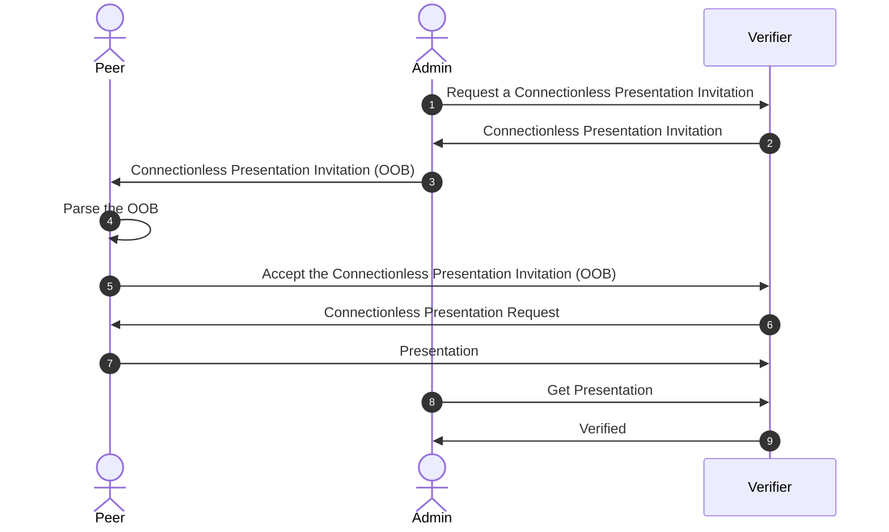

# Edge SDK Connectionless Presentation

## User Flow



## Steps

1. **Admin** requests a connectionless presentation request invitation from the **Verifier**

    ```bash
    curl --location 'http://localhost:9000/cloud-agent/present-proof/presentations/invitation' \
    --header 'Content-Type: application/json' \
    --data '{
      "goalCode" : "present-vp",
      "goal" : "Request presentation",
      "proofs": [],
      "options": {
        "challenge": "a6af4ea1-2f11-43de-bd17-e0182e55f919",
        "domain": "http://localhost:9000/cloud-agent"
      }
    }'
    ```

2. The **Verifier** sends back the `Connectionless Presentation Request Invitation`
    - Response example:

      ```json
      {
        "presentationId": "76b2b571-8456-4413-8dd3-d8f5186fd472",
        "thid": "9d99f0b4-25b7-47e6-8816-1687c86dc3f1",
        "role": "Verifier",
        "status": "InvitationGenerated",
        "proofs": [],
        "data": [],
        "requestData": [
          {
            "options": {
              "challenge": "a6af4ea1-2f11-43de-bd17-e0182e55f919",
              "domain" : "http://localhost:9000/cloud-agent"
            },
            "presentation_definition" : {
              "id": "070cd2f8-e8cc-4ae4-94bd-3ac886fed6df",
              "input_descriptors": [],
              "name": null,
              "purpose": null,
              "format" : null
            }
          }
        ],
        "goalCode": "present-vp",
        "goal": "Request presentation",
        "myDid": "did:peer:2.Ez6LS...",
        "invitation": {
          "id": "9d99f0b4-25b7-47e6-8816-1687c86dc3f1",
          "type": "https://didcomm.org/out-of-band/2.0/invitation",
          "from": "did:peer:2.Ez6LS...9",
          "invitationUrl": "https://my.domain.com/path?_oob=eyJpZCI6IjlkOTlmMGI0LTI1YjctNDdlNi04ODE2LTE2ODdjODZkYzNmMSIsInR5cGUiOiJodHRwczovL2RpZGNvbW0ub3JnL291dC1vZi1iYW5kLzIuMC9pbnZpdGF0aW9uIiwiZnJvbSI6ImRpZDpwZWVyOjIuRXo2TFNpb2Foa3lncmZ0cnpLUWM2aXNyVngyTEhoSlFpQTF1U0ZCeHBXMW02aE56SC5WejZNa2VvdlE5bUVoVm9TcXJucUhkYVltRjhHRTdvOXlXWTJvVmlrdThFelhLNGloLlNleUowSWpvaVpHMGlMQ0p6SWpwN0luVnlhU0k2SW1oMGRIQTZMeTh4T1RJdU1UWTRMalk0TGpZeU9qa3dNREF2Wkdsa1kyOXRiU0lzSW5JaU9sdGRMQ0poSWpwYkltUnBaR052YlcwdmRqSWlYWDE5IiwiYm9keSI6eyJnb2FsX2NvZGUiOiJwcmVzZW50LXZwIiwiZ29hbCI6IlJlcXVlc3QgcHJlc2VudGF0aW9uIiwiYWNjZXB0IjpbImRpZGNvbW0vdjIiXX0sImF0dGFjaG1lbnRzIjpbeyJpZCI6ImZjMGQ1MWY0LTlhMmItNDVmOS1hM2E0LWJkNmQwZTE2MzZjZCIsIm1lZGlhX3R5cGUiOiJhcHBsaWNhdGlvbi9qc29uIiwiZGF0YSI6eyJqc29uIjp7ImlkIjoiYjgwMDkyZGUtZTU2MS00YzI2LTkzNzYtMTgxMWEwMWNiNWNjIiwidHlwZSI6Imh0dHBzOi8vZGlkY29tbS5hdGFsYXByaXNtLmlvL3ByZXNlbnQtcHJvb2YvMy4wL3JlcXVlc3QtcHJlc2VudGF0aW9uIiwiYm9keSI6eyJnb2FsX2NvZGUiOiJSZXF1ZXN0IFByb29mIFByZXNlbnRhdGlvbiIsIndpbGxfY29uZmlybSI6ZmFsc2UsInByb29mX3R5cGVzIjpbXX0sImF0dGFjaG1lbnRzIjpbeyJpZCI6IjIyOTM0Y2U5LTJmMzMtNDkxYS1hODEyLTAyOGNkMDAzYjQ3NiIsIm1lZGlhX3R5cGUiOiJhcHBsaWNhdGlvbi9qc29uIiwiZGF0YSI6eyJqc29uIjp7Im9wdGlvbnMiOnsiY2hhbGxlbmdlIjoiYTZhZjRlYTEtMmYxMS00M2RlLWJkMTctZTAxODJlNTVmOTE5IiwiZG9tYWluIjoiaHR0cDovL2xvY2FsaG9zdDo5MDAwL2Nsb3VkLWFnZW50In0sInByZXNlbnRhdGlvbl9kZWZpbml0aW9uIjp7ImlkIjoiMDcwY2QyZjgtZThjYy00YWU0LTk0YmQtM2FjODg2ZmVkNmRmIiwiaW5wdXRfZGVzY3JpcHRvcnMiOltdfX19LCJmb3JtYXQiOiJwcmlzbS9qd3QifV0sInRoaWQiOiI5ZDk5ZjBiNC0yNWI3LTQ3ZTYtODgxNi0xNjg3Yzg2ZGMzZjEiLCJmcm9tIjoiZGlkOnBlZXI6Mi5FejZMU2lvYWhreWdyZnRyektRYzZpc3JWeDJMSGhKUWlBMXVTRkJ4cFcxbTZoTnpILlZ6Nk1rZW92UTltRWhWb1Nxcm5xSGRhWW1GOEdFN285eVdZMm9WaWt1OEV6WEs0aWguU2V5SjBJam9pWkcwaUxDSnpJanA3SW5WeWFTSTZJbWgwZEhBNkx5OHhPVEl1TVRZNExqWTRMall5T2prd01EQXZaR2xrWTI5dGJTSXNJbklpT2x0ZExDSmhJanBiSW1ScFpHTnZiVzB2ZGpJaVhYMTkifX19XSwiY3JlYXRlZF90aW1lIjoxNzMwMTY3MTIxLCJleHBpcmVzX3RpbWUiOjE3MzAxNjc0MjF9"
        },
        "metaRetries": 5
      }
      ```

3. The **Admin** forwards the `invitationUrl` to the **Peer**.

4. The **Peer** validates the `invitationUrl` with `agent.parseInvitation`:

    ```typescript
    const oob = await agent.parseInvitation(invitationUrl)
    ```

5. The **Peer** accepts the invitation using `agent.acceptInvitation`:

    ```typescript
    await agent.acceptInvitation(oob)
    ```

6. The **Verifier** sends the presentation request to the **Peer**.

7. The **Peer** listens for the presentation request and prepares the presentation of the verifiable credential.

    ```typescript
    agent.addListener(SDK.ListenerKey.MESSAGE, async (newMessages: SDK.Domain.Message[]) => {
      const presentationRequests = newMessages.filter(
        (message) => message.piuri === SDK.ProtocolType.DidcommRequestPresentation
      )

      const credentials = await agent.pluto.getAllCredentials()
      const lastCredential = lastCredentials.at(-1)

      if (presentationRequests.length) {
        for (const requestMessage of presentationRequests) {
          try {
            const presentationRequest = await SDK.RequestPresentation.fromMessage(requestMessage)
            const presentation = await agent.createPresentationForRequestProof(presentationRequest, lastCredential)
            await agent.sendMessage(presentation.makeMessage())
          } catch (err) {
            console.error('Error presenting the credential:', err)
          }
        }
      }
    })
    ```

8. The **Admin** requests the presentation from the **Verifier**

    ```bash
    curl -X GET "http://localhost:9000/present-proof/presentations/76b2b571-8456-4413-8dd3-d8f5186fd472" \
    -H "accept: application/json" \
    -H "Content-Type: application/json" \
    -H "apikey: [[VERIFIER_API_KEY]]"
    ```

9. The **Verifier** responds that the Credential is verified

    - Response example:

    ```json
    {
      "presentationId": "76b2b571-8456-4413-8dd3-d8f5186fd472",
      "thid": "9d99f0b4-25b7-47e6-8816-1687c86dc3f1",
      "role": "Verifier",
      "status": "PresentationVerified",
      "proofs": [],
      "data": [
        "eyJhbGciOiJFUzI...."
      ],
      "requestData": [
        {
          "options": {
            "challenge": "a6af4ea1-2f11-43de-bd17-e0182e55f919",
            "domain" : "http://localhost:9000/cloud-agent"
          },
          "presentation_definition" : {
            "id": "070cd2f8-e8cc-4ae4-94bd-3ac886fed6df",
            "input_descriptors": [],
            "name": null,
            "purpose": null,
            "format" : null
          }
        }
      ],
      "goalCode": "present-vp",
      "goal": "Request presentation",
      "myDid": "did:peer:2.Ez6LS...",
      "invitation": {
        "id": "9d99f0b4-25b7-47e6-8816-1687c86dc3f1",
        "type": "https://didcomm.org/out-of-band/2.0/invitation",
        "from": "did:peer:2.Ez6LS...9",
        "invitationUrl": "https://my.domain.com/path?_oob=eyJpZCI6IjlkOTlmMGI0LTI1YjctNDdlNi04ODE2LTE2ODdjODZkYzNmMSIsInR5cGUiOiJodHRwczovL2RpZGNvbW0ub3JnL291dC1vZi1iYW5kLzIuMC9pbnZpdGF0aW9uIiwiZnJvbSI6ImRpZDpwZWVyOjIuRXo2TFNpb2Foa3lncmZ0cnpLUWM2aXNyVngyTEhoSlFpQTF1U0ZCeHBXMW02aE56SC5WejZNa2VvdlE5bUVoVm9TcXJucUhkYVltRjhHRTdvOXlXWTJvVmlrdThFelhLNGloLlNleUowSWpvaVpHMGlMQ0p6SWpwN0luVnlhU0k2SW1oMGRIQTZMeTh4T1RJdU1UWTRMalk0TGpZeU9qa3dNREF2Wkdsa1kyOXRiU0lzSW5JaU9sdGRMQ0poSWpwYkltUnBaR052YlcwdmRqSWlYWDE5IiwiYm9keSI6eyJnb2FsX2NvZGUiOiJwcmVzZW50LXZwIiwiZ29hbCI6IlJlcXVlc3QgcHJlc2VudGF0aW9uIiwiYWNjZXB0IjpbImRpZGNvbW0vdjIiXX0sImF0dGFjaG1lbnRzIjpbeyJpZCI6ImZjMGQ1MWY0LTlhMmItNDVmOS1hM2E0LWJkNmQwZTE2MzZjZCIsIm1lZGlhX3R5cGUiOiJhcHBsaWNhdGlvbi9qc29uIiwiZGF0YSI6eyJqc29uIjp7ImlkIjoiYjgwMDkyZGUtZTU2MS00YzI2LTkzNzYtMTgxMWEwMWNiNWNjIiwidHlwZSI6Imh0dHBzOi8vZGlkY29tbS5hdGFsYXByaXNtLmlvL3ByZXNlbnQtcHJvb2YvMy4wL3JlcXVlc3QtcHJlc2VudGF0aW9uIiwiYm9keSI6eyJnb2FsX2NvZGUiOiJSZXF1ZXN0IFByb29mIFByZXNlbnRhdGlvbiIsIndpbGxfY29uZmlybSI6ZmFsc2UsInByb29mX3R5cGVzIjpbXX0sImF0dGFjaG1lbnRzIjpbeyJpZCI6IjIyOTM0Y2U5LTJmMzMtNDkxYS1hODEyLTAyOGNkMDAzYjQ3NiIsIm1lZGlhX3R5cGUiOiJhcHBsaWNhdGlvbi9qc29uIiwiZGF0YSI6eyJqc29uIjp7Im9wdGlvbnMiOnsiY2hhbGxlbmdlIjoiYTZhZjRlYTEtMmYxMS00M2RlLWJkMTctZTAxODJlNTVmOTE5IiwiZG9tYWluIjoiaHR0cDovL2xvY2FsaG9zdDo5MDAwL2Nsb3VkLWFnZW50In0sInByZXNlbnRhdGlvbl9kZWZpbml0aW9uIjp7ImlkIjoiMDcwY2QyZjgtZThjYy00YWU0LTk0YmQtM2FjODg2ZmVkNmRmIiwiaW5wdXRfZGVzY3JpcHRvcnMiOltdfX19LCJmb3JtYXQiOiJwcmlzbS9qd3QifV0sInRoaWQiOiI5ZDk5ZjBiNC0yNWI3LTQ3ZTYtODgxNi0xNjg3Yzg2ZGMzZjEiLCJmcm9tIjoiZGlkOnBlZXI6Mi5FejZMU2lvYWhreWdyZnRyektRYzZpc3JWeDJMSGhKUWlBMXVTRkJ4cFcxbTZoTnpILlZ6Nk1rZW92UTltRWhWb1Nxcm5xSGRhWW1GOEdFN285eVdZMm9WaWt1OEV6WEs0aWguU2V5SjBJam9pWkcwaUxDSnpJanA3SW5WeWFTSTZJbWgwZEhBNkx5OHhPVEl1TVRZNExqWTRMall5T2prd01EQXZaR2xrWTI5dGJTSXNJbklpT2x0ZExDSmhJanBiSW1ScFpHTnZiVzB2ZGpJaVhYMTkifX19XSwiY3JlYXRlZF90aW1lIjoxNzMwMTY3MTIxLCJleHBpcmVzX3RpbWUiOjE3MzAxNjc0MjF9"
      },
      "metaRetries": 5
    }
    ```
